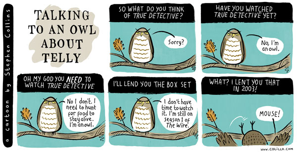

---
# Feel free to add content and custom Front Matter to this file.
# To modify the layout, see https://jekyllrb.com/docs/themes/#overriding-theme-defaults
layout: home-noposts
---

Hi, I'm **Ali Almasi**. I am a PhD-track computer science student currently enrolled in the M2 year of the [Master Parisien de Recherche en Informatique (MPRI)](https://wikimpri.dptinfo.ens-cachan.fr/doku.php?id=start) at [École Polytechnique](https://www.polytechnique.edu), part of the [Institut Polytechnique de Paris](https://www.ip-paris.fr). I previously completed my undergraduate studies at [Sharif University of Technology](https://www.sharif.edu/en), where I obtained a bachelor's degree in mathematics with a minor in computer science.

I like quantum information science, mostly the information-theoretic and complexity-theoretic aspects. I enjoy using tools from optimization theory, mathematical analysis, and discrete mathematics to tackle problems in these areas.

# CV

## Education
*   (2023 - Present) MSc. in Foundations of Computer Science (MPRI),
	 [École polytechnique](https://www.polytechnique.edu/), Paris, France
	 - Recipient of the IP Paris scholarship
*   (2021 - 2023) Minor in Computer Science,
	 [Sharif University of Technology](https://en.sharif.edu/), Iran
*   (2018 - 2023) BSc. in Mathematics,
	 [Sharif University of Technology](https://en.sharif.edu/), Iran

## Experience
*   (April 2024 - August 2024) Research Intern,
	 [Quriosity](https://quriosity.telecom-paris.fr/), Télécom Paris, Paris, France
	- Supervisors: [Peter Brown](https://peterjbrown519.github.io/), [Cambyse Rouzé](https://www.xn--cambyserouz-lbb.fr)
*   (2020 - 2023) Teaching Assistant,\
	 During my undergraduate studies at Sharif University of Technology, I worked as a teaching assistant for several courses, including *Automata Theory, Theory of Computer Science, Linear Algebra, Probability, and Logic*. [See the Misc. section](https://ali-almasi.github.io/misc/) if you want to know more.

## Projects and Publications

-   See the [Publications section](https://ali-almasi.github.io/projects).

## Talks and Presentations 

-  See the [Talks section](https://ali-almasi.github.io/talks/).

## Other activities

I was a member of the [Students Scientific Association (Hamband)](https://hamband.math.sharif.ir/wiki/%D8%A7%D8%B9%D8%B6%D8%A7%DB%8C_%D9%87%D9%85%D8%A8%D9%86%D8%AF/%D8%AF%D8%A7%D9%86%D8%B4%D9%86%D8%A7%D9%85%D9%87) at Sharif University of Technology, where we organized several math and CS related events for the students. I am also an active editor of [Sharif Mathematics Journal](https://sharif-math-journal.github.io/), a student journal conducted by current and former students of the mathematics department at Sharif University of Technology (the journal itself is not affiliated with the university). [See the Misc. section](https://ali-almasi.github.io/misc/) if you want to know more.

