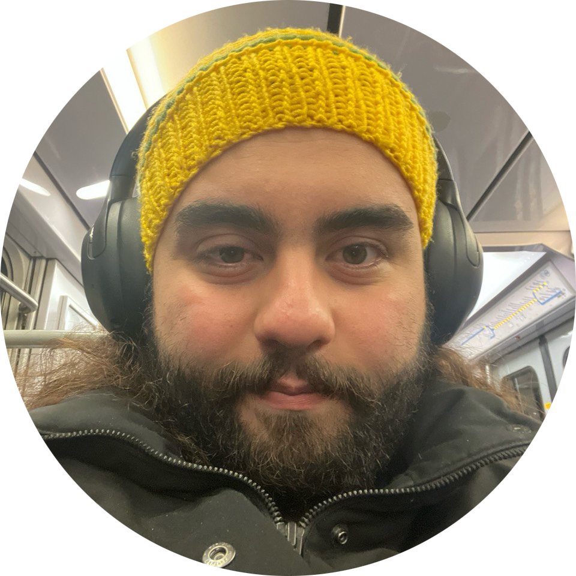

---
# Feel free to add content and custom Front Matter to this file.
# To modify the layout, see https://jekyllrb.com/docs/themes/#overriding-theme-defaults
layout: home-noposts
---

Hi, I'm **Ali Almasi**. I am a PhD-track computer science student currently enrolled in the M2 year of the [Master Parisien de Recherche en Informatique (MPRI)](https://wikimpri.dptinfo.ens-cachan.fr/doku.php?id=start) at [École Polytechnique](https://www.polytechnique.edu), part of the [Institut Polytechnique de Paris](https://www.ip-paris.fr). I previously completed my undergraduate studies at [Sharif University of Technology](https://www.sharif.edu/en), where I obtained a bachelor's degree in mathematics with a minor in computer science.

You can find my CV [here](assets/pdf/Resume.pdf).

I like quantum information science, mostly the information-theoretic and complexity-theoretic aspects. I enjoy using tools from optimization theory, mathematical analysis, and discrete mathematics to tackle problems in these areas.

## معرفی کوتاه به فارسی
سلام دنیا

رده‌بندی موضوعاتی که به آن‌ها علاقه‌مندم:
- تئوری اطلاعات کوانتومی
- پیچیدگی محاسباتی
- تئوری گراف
- تئوری اعداد 
I was a member of the [Students Scientific Association (Hamband)](https://hamband.math.sharif.ir/wiki/%D8%A7%D8%B9%D8%B6%D8%A7%DB%8C_%D9%87%D9%85%D8%A8%D9%86%D8%AF/%D8%AF%D8%A7%D9%86%D8%B4%D9%86%D8%A7%D9%85%D9%87) at Sharif University of Technology in the academic year 2019-2020, where we organized several math and CS related events for the students. You can find an [here](assets/pdf/Hamband.pdf) an infographic about the activities of the association in that year.

 I am also an active editor of [Sharif Mathematics Journal](https://sharif-math-journal.github.io/), a student journal conducted by current and former students of the mathematics department at Sharif University of Technology (the journal itself is not affiliated with the university). [See the Misc. section](https://ali-almasi.github.io/misc/) if you want to know more.

